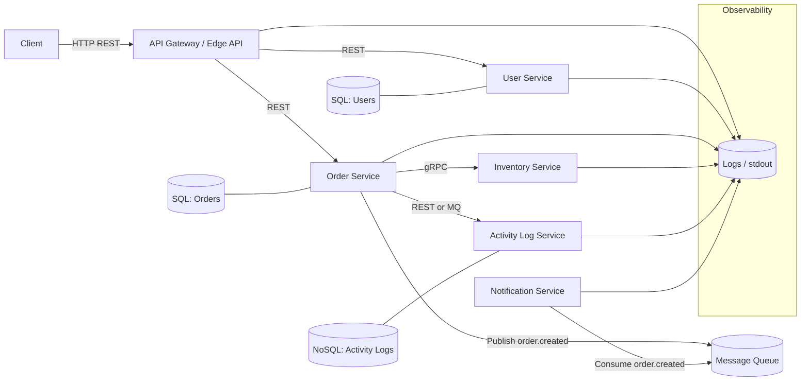

# Order & Notification Platform – High-Level Architecture

This document describes the high-level architecture of the **Order & Notification Platform**, a small but extensible microservices system designed for learning modern backend concepts such as REST, gRPC, SQL, NoSQL, message queues, and observability.

The system is built in incremental phases. This document defines services, responsibilities, communication patterns, and data storage choices. Implementation details are not included here.

---

## 1. System Overview

The platform processes customer orders, validates users, checks inventory availability, logs activity events, and triggers notifications.  
It consists of several independently deployable backend services, each responsible for a clear domain.

The system is intentionally kept small, simple, and easy to extend while demonstrating real-world architecture patterns.

---

## 2. Services Overview

### 2.1. API Gateway / Edge API (Optional in initial phases)

Acts as the single entrypoint for client applications.

Responsibilities:
- Route external REST requests to internal services.
- Centralize cross-cutting concerns (optional).
- Generate and propagate request IDs (later phases).

Initially this service is optional; clients may call the Order Service directly.

---

### 2.2. User Service

Responsible for:
- User registration and retrieval.
- Storing user information.
- Providing user validation to other services.

Storage:
- SQL (PostgreSQL)

Communication:
- REST (HTTP)

---

### 2.3. Order Service

The central service of the system.

Responsibilities:
- Creating and retrieving orders.
- Validating users via the User Service.
- Checking inventory via the Inventory Service.
- Logging activity events.
- Publishing domain events to the message queue.

Storage:
- SQL (PostgreSQL)

Communication:
- REST (client → service)
- REST (Order → User)
- gRPC (Order → Inventory)
- MQ (Order → Notification)

---

### 2.4. Inventory Service

Responsible for:
- Checking stock availability.
- Reserving stock for new orders.

Communication:
- gRPC (primary)

Storage:
- Initially in-memory  
- May evolve into Redis or a NoSQL database

---

### 2.5. Activity Log Service

Responsible for:
- Storing event/activity logs
- Providing query endpoints for logs per order or user

Storage:
- NoSQL (MongoDB)

Input:
- Initially via REST from Order Service
- Later via MQ (optional)

---

### 2.6. Notification Service

Responsible for:
- Consuming events from the message queue
- Producing notifications (initial: logging, later: email/push/etc.)

No storage required in early phases.

---

### 2.7. Message Queue

RabbitMQ or Redis Streams.  
Used for publishing and consuming domain events.

Responsibilities:
- Decouple Order Service from Notification Service.
- Enable asynchronous communication.
- Allow multiple consumers if needed (notifications, logging, analytics).

---

## 3. Data Storage

### 3.1. SQL (PostgreSQL)
Used by:
- User Service
- Order Service

Approaches:
1. Shared database with separate schema/tables  
2. Independent databases per service (more isolation, more overhead)

### 3.2. NoSQL (MongoDB)
Used by:
- Activity Log Service

Optional:
- Redis for inventory or caching

---

## 4. Communication Patterns

### 4.1. External (Client → System)
- REST (HTTP)
- Initially request goes directly to the Order Service.
- Later: optional API Gateway.

### 4.2. Internal (Service → Service)

REST:
- Order Service → User Service
- Order Service → Activity Log Service (initial)

gRPC:
- Order Service → Inventory Service

Message Queue:
- Order Service → MQ (publish)
- Notification Service → MQ (consume)
- Activity Log Service → MQ (optional consume)

---

## 5. Observability

### 5.1. Logging
All services should output structured JSON logs including:
- timestamp  
- level  
- service_name  
- message  
- request_id (in later phases)

### 5.2. Health Checks
Each service exposes:
`GET /health`
Example response:
```json
{"status": "ok"}
```

### 5.2. Request Tracing (Later Phase)
- A request ID is generated by API Gateway or first service.
- Propagated across REST, gRPC, and MQ messages.
- Enables tracing a request end-to-end.

## 6. High-Level Architecture Diagram


## 7. Summary

This architecture defines the foundation for the Order & Notification Platform.

Included in this document:
- All services and their responsibilities
- Ownership of SQL and NoSQL databases
- REST, gRPC, and MQ communication patterns
- Observability expectations
- A unified system diagram

Next steps are defined in phase1.md, starting with building the Order Service MVP.