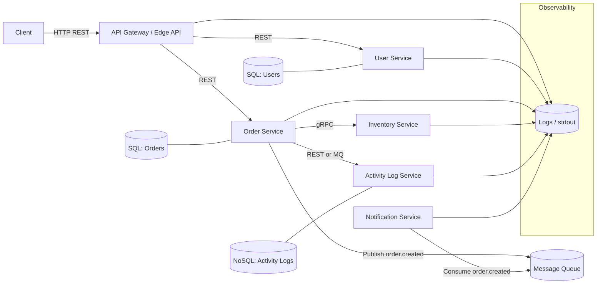

# Order & Notification Platform – High-Level Architecture

This document describes the high-level architecture of the **Order & Notification Platform**, a small but extensible microservices system designed for learning modern backend concepts such as REST, gRPC, SQL, NoSQL, message queues, and observability.

The system is built in incremental phases. This document does not include implementation details; it defines services, responsibilities, communication patterns, and data storage choices.

---

## 1. System Overview

The platform processes customer orders, validates users, checks inventory availability, logs activity events, and triggers notifications. It consists of several independently deployable backend services, each responsible for a clear domain.

The system is intentionally kept small, simple, and easy to extend.

---

## 2. Services

### 2.1. API Gateway / Edge API (Optional at first)

Acts as the single public entrypoint for client applications.  
Responsibilities:
- Route external REST requests to internal services.
- Optionally generate request IDs and handle cross-cutting concerns.

Initially optional. The client may call the Order Service directly in early stages.

---

### 2.2. User Service

Responsible for:
- User registration and retrieval.
- Storing user data.
- Providing user validation to other services.

Storage:
- SQL (PostgreSQL)

Communication:
- REST (HTTP)

---

### 2.3. Order Service

The central service in the system.  
Responsible for:
- Creating orders.
- Retrieving orders.
- Validating user existence (via User Service).
- Checking and reserving stock (via Inventory Service).
- Writing activity logs.
- Publishing events (e.g. `order.created`) to the message queue.

Storage:
- SQL (PostgreSQL)

Communication:
- REST (client → service)
- REST (Order → User)
- gRPC (Order → Inventory)
- MQ (Order → Notification)

---

### 2.4. Inventory Service

Responsible for:
- Checking stock availability.
- Reserving stock for orders.

Communication:
- gRPC (primary)

Storage:
- Can start as in-memory for simplicity.
- Can evolve into a NoSQL or Redis-based store later.

---

### 2.5. Activity Log Service

Responsible for:
- Storing activity and event information.
- Providing access to logs based on order or user.

Storage:
- NoSQL (MongoDB)

Input:
- Initially via REST from the Order Service.
- May later consume events directly from the MQ.

---

### 2.6. Notification Service

Responsible for:
- Consuming events from the message queue.
- Triggering notifications (initially simple logging, later email or external services).

Storage:
- Not required in initial phases.

---

### 2.7. Message Queue

RabbitMQ or Redis Streams.

Used for:
- Publishing domain events (`order.created`).
- Decoupling Order Service from Notification Service.
- Supporting event-driven patterns.

---

## 3. Data Storage

### SQL (PostgreSQL)
Used by:
- User Service
- Order Service

Possible approaches:
1. Shared database with separate schemas (simple).
2. Independent databases per service (more isolated, heavier).

### NoSQL (MongoDB)
Used by:
- Activity Log Service

Additional optional NoSQL:
- Redis for inventory caching or storage.

---

## 4. Communication Patterns

### 4.1. Client → System
- REST (HTTP)
- Initially routed directly to the Order Service
- Later optionally routed through the API Gateway

### 4.2. Inter-service communication
- **REST:**  
  Order Service → User Service  
  Order Service → Activity Service (initial phase)

- **gRPC:**  
  Order Service → Inventory Service

- **Message Queue:**  
  Order Service → Message Queue  
  Notification Service → Message Queue (consumer)  
  Activity Log Service → Message Queue (optional consumer)

---

## 5. Observability

### 5.1. Logging
All services should produce structured JSON logs with:
- timestamp  
- level  
- service_name  
- message  
- request_id (added once API Gateway is introduced)

### 5.2. Health Endpoints
Each service exposes:
GET /health
Returning a simple JSON payload, such as:
{"status": "ok"}

### 5.3. Request Tracing (Optional Later)
- Generate a request ID in the API Gateway or entry service.
- Pass it through REST, gRPC, and MQ messages.
- Use it to correlate logs across services.

---

## 6. High-Level Architecture Diagram

## 6. Summary
This document defines the high-level architecture for the Order & Notification Platform.

Included:

- List of all services
- Responsibilities per service
- Ownership of SQL and NoSQL databases
- REST, gRPC, and MQ communication paths
- Observability practices
- High-level diagram